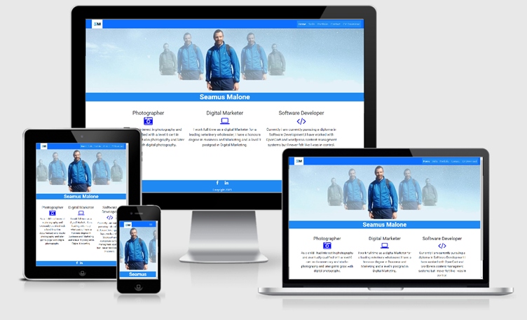
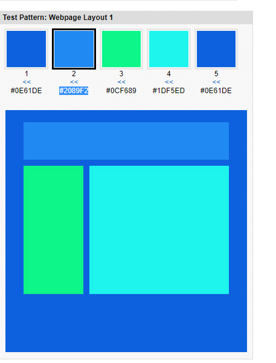
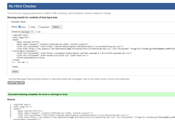
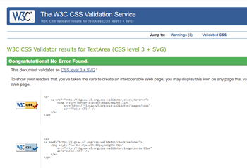
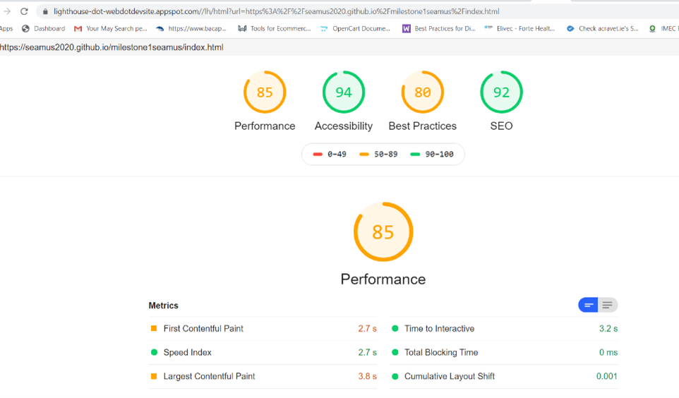
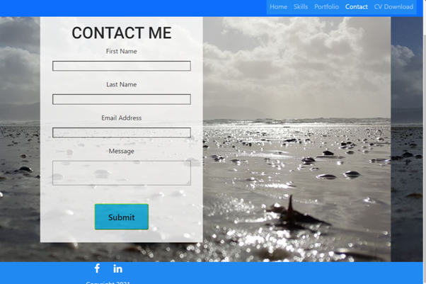
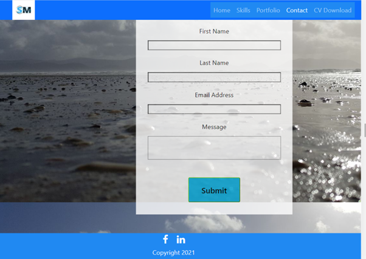

Seamus Malone Portfolio

Over the years I created a portfolio of work to show employers at interviews or clients who I served daily who wanted ideas.This Portfolio will be ideal as I won't have to carry that book around with me anymore.
A valuable useful Solution that will contunue to add to and use.

--------
## UX

UX is concerned with the creation of products that are. 
**useful, usable, valuable.**

## User Stories

A user visits the page.

1.	I want to learn more about Seamus Malone.
1.	I want to learn more about Seamus Malone.
1.	I want to see his skills.
1.	I want to see his portfolio.
1.	I want to contact him through social links.
1.	I want to send him a message.
1.	I want to download his CV. 

When thinking about the project I based my design on the 5 main elements which are 
### Strategy: 
my own objective and the objective I want for the user

### Own user goal
1. To provide a user with information that will give them a real insight into my work.
1. To create a visually pleasing portfolio that showcases my experience and skills.
1. The aim is for the end user, recruiter’s employer to contact me.

### Goal for End user 
1.	Potential employer to see a broad range of skills /qualifications /portfolio.
1.	Potential employer or recruiter sees me for my individual skills as a photographer, Software Developer or Digital Marketing or all three combined.
1.	A recruiter contacts me on my social channels. 
1.	A potential employer contacts me by email or phone after finding by cv.
1.	My webpage is shared with potential users for further opportunities.
1.	My cv is downloaded.

### Scope:
when deciding on pages and features to help me achieve my goals and objectives, I was apprehensive about it thinking would I have the skills and time to complete it. What features on each page will engage users. How many pages will show all information achieve objectives? Five pages was the minimum needed to convey everything home being the general welcome page and one being a cv download page and others made up of Skills, Contact and Portfolio.

### Structure:
known people read left to right was stuck in my head the whole time during this project and I always thought my navigation should be on the left-hand side but opted for right under advice but arranged the most important elements of navigation left to right.
### Skeliton:

 

[Wireframes](assets/Wireframepdf/wireframeproject.pdf)	

### Surface:
When developing the look, colour, typography and remembering about being consistent across the whole site, top and lower of page should be the same and to use similar colours and keeping things simple and readable. I started with colour and I designed my home page Jumbotron to incorporate my favourite colour Blue, colour phycology is a thing according to the fast company it means trust (fast company) I used colorspire below to pick out my colours. The font family Roboto, I always liked it and my company I work for use it on their website too. 

--------
## Features:
I knew what pages I wanted from the beginning and from talking with the mentor jack, we had decided what bootstrap frames would work with my portfolio.  The overall layout to choose one big scrolling page or original separate clickable pages, in the end I opted to differentiate each page with a clickable button on top right-hand side. The bottom is the same on all the pages consisting of the social links.
### Home page:
The home page being the most general highlighting my titles and a little info on qualifications. The bootstrap Jumbotron frame was ideal for me, I just removed the view details boxes. The image I created first using Canva was supposed to be aligned with the menu items but after careful consideration and after discussing it my idea with my mentor I changed direction but kept the picture as it was important for my home screen. The page is simple and inviting and Colours work well. 

### Skills:
Initially I was going to just put a list of my skills, but I thought it looked bland and decided to put progress bar highlighting the strength of my skill in percentage, plus adding a bit of colour. In the future it would be nice to make these more interactive or dazzling

### Portfolio:
This page should be plain and simple, and they usually are, when I completed the love running page, I loved the idea of background image, originally, I put the image on the form background itself and white background, but My mentor thought it would be hard for the user to see what they were typing, so I set it to the background and changing the opacity of the form to make it blend in slightly. He was right it looks much better. Having input fields name and email and a message field as required 

### CV download.
Shows more detail of the experience and qualification and more reason for the target audience to contact direct my telephone or email.

***In the future I would like to add Testimonials from employers or colleagues.***
--------
## Technology
1. CSS.
1. HTML. 
1. Canva.
1. Boostrap.
1. font awsome.
1. Google font.
1. colourspire.
1. Flex-box.
1. Youtube.
1. Javascript and js.popper indirectly used as they were needED to make the navbar work.
1. Lighthouse to see the performance.
1. Responsive design to make my mock ups.
1. W3C HTML & CSS Validator service
1. Chrome Dev.
--------
## Deployment to live version
1.  First, I opened up git hub and looked for my repository [seamus2020/milestone1seamus](https://github.com/seamus2020/milestone1seamus) 
1.	clicked on it to open it.
1.	Then I clicked settings
1.	Scrolled down to GitHub pages.
1.	Clicked the dropdown beside none to select branch and then I clicked master.
1.	I had published my page already and the page refreshed version  appeared above.
## deployment local
1. Visit my github repository here [seamus2020/milestone1seamus](https://github.com/seamus2020/milestone1seamus) 	
1.    Under the repository name, click "Clone or download".
1.	In the Clone with HTTPs section, copy the clone URL for the repository.
1.	In your local IDE open the terminal.
1.	Change the current working directory to the location where you want the cloned directory to be made.
1.	Type git clone, and then paste the URL you copied in Step 3.
1.   git clone https://github.com/USERNAME/REPOSITORY
1.	Press Enter. Your local clone will be created.

the deployed version is available constantly while the repository is only available when you log in to github.
--------

## Testing the website
**All html code and css went through the validator see below.**

I also used Lighthouse to see the performance.

I tested the website a good few times and found little issues along the way that made me go mad at times but with the help chrome dev tools I was able to fix some and of course I required help and guidance from tutors and my mentor jack whenever we had a call. I found myself testing the webpages on all devices daily. Boostrap is a great framework for helping building code but it can land you in trouble too not known what to style in CSS. Chrome dev helped when looking for boostrap classes and of course examining where I went wrong. My biggest issues were the footer it was just not anchoring to the bottom from day one, I tried to push it down   as I did not have enough content. I built the page using a laptop but the odd time I would look at the code on the big screen, seeing the space under the footer would annoy me eventually I was introduced to flexbox that saved me losing my mind, I had asked a few people about the footer, but no one knew more than @Miklos, he solved it.
Making sure my pages were resonsive on Chrome and Internet explorer, I tested on Ipone and samsung phone, large scree desktop and laptop and ipad, I am sure there are mistakes buts that is inevitable at the begining.

Testing the pages from user stories
1.	I want to learn more about Seamus Malone.
1.	I want to see his skills.
1.  I want to see his portfolio.
1.	I want to contact him through social links.
1.	I want to send him a message.
1.	I want to download CV. 

Ideally the user will land on the Home page get an insight in to Seamus Malone and then decide where to go with the navigation up on the top right, the most popular pages left to right, a hover feature that highlights each menu, its eye catching 2-colour affect. Once a page is clicked it becomes active highlighted white to let user know he/she is on that page. All pages have the social links at the bottom that work, this will enable a user to contact me through social channels. There is a clickable logo on the top right logo that links back to the home page for all pages. I used html inline style to style it.
While I see the user visiting all the pages the skills page and Portfolio which will probably be top of their list, the skills page is the same framework as the home page with out the Jumbotron well originally I had left it in see below but it didn’t sit well when scaling down on mobile device so I went with three separate images and a boostrap progress framework to show the skills under it.

The user can see my skills in all three disciplines.
T
The Portfolio pages are broken down in to four categories to give a broad range of my work while I wanted to include this project, I thought it might be foolish linking to it, someday I will. I used the bootstrap album for this one and taking out anything I felt I did not need. I would have liked to centre the videos more on the card, I asked and googled but unfortunately no result. The portfolio looks good on all devices especially on mobile as it amplifies the imagery more.

The Contact page was inspired by the love running challenge and I think it works well with the background again I found it difficult to get the form centred and spent days tweaking until again I discovered the flex- container to centre it. All the inputs are tested, and all the information is required, even if the user fails to fill it out, they are reminded this field is required.
Today after all the testing I decided to double check the contact page see below, I thought everything was fine with the form and it started acting up, I set the background attachment to fixed and viewport height to 100 vh. 

The CV download was the easiest page to complete, I wish they were all like this. Its tested it opens and download too.
--------
## credits
All the Pictures are mine except for the ones I used on the skills page, I have a membership with Canva pro which allows me to use any image I want for business or pleasure.

Boostrap was used for most of the features as it made the pages responsive especially on the home, skills and Portfolio pages.

Flex-box and the container was the other I used for footers and the form on the Contact page.

The love running code helped me create my contact page/form but I ran in to lots of issues there.

stackoverflow and w3 schools helped tease out issues.

The tutors and my Mentor heLped mostly.

There are many wonderful websites I got Inspired from, I saw this one and it inspired me .
https://devamari.com/

Happy coding!
